# AUDIOCODES CHATBOT INTEGRATION

### TABLE OF CONTENTS
* [Introduction](#introduction)
* [Features](#features)
* [Building the Audiocodes Connector](#building-the-audiocodes-connector)
    * [Required Configuration](#required-configuration)
    * [Optional Configuration](#optional-configuration)
	* [ESCALATION (chat.php)](#escalation-chatphp)
	* [CONVERSATION (conversation.php)](#conversation-conversationphp)
	* [ENVIRONMENTS (environments.php)](#environments-environmentsphp)
	* [Deployment](#deployment)
* [Audiocodes Configuration](#audiocodes-configuration)
    * [Account](#account)
    * [Credit](#credit)
    * [Bot Configuration](#bot-configuration)
* [Token](#token)
* [Prepare your Inbenta instances](#prepare-your-inbenta-instances)
    * [Text Content](#text-content)
    * [Farewell content](#farewell-content)


## **Introduction**
You can extend Inbenta’s chatbot capabilities to voice with this connector to integrate with [Audiocodes](https://www.audiocodes.com/).

## **Features**
The following features of Inbenta’s chatbot are supported in the Audiocodes integration:
* Answer Text.
* Sidebubble.
* Multiple options.
* Polar Questions.
* Dialogs.
* Forms, Actions & Variables (Keep in mind we are using voice as a channel. So, not all variable types work best with voice. Example: Email, Date).

## **Building the Audiocodes Connector**

### **Required Configuration**

In your UI directory, go to **conf**. Here, you have a readme file with some structure and usage explanations.

Fill the **key** and **secret** values inside the **conf/custom/api.php** file with your Inbenta Chatbot API credentials ([Here](https://help.inbenta.com/en/general/administration/managing-credentials-for-developers/finding-your-instance-s-api-credentials/) is the documentation on how to find the key and secret from Inbenta’s backstage. Use the same credentials as backstage to access the article).

### **Optional Configuration**

There are some optional features (see the list below) that can be enabled from the configuration files. Every optional configuration file should be copied from **/conf/default** and store the custom version in **/conf/custom**. The bot will detect the customization and it will load the customized version. 


### **ESCALATION (chat.php)**

*   **chat** 
    *   **enabled**: Enable or disable HyperChat (“**true**” or “**false**”).
    *   **address**: Phone number that will be used to make the transfer (e.g. ```tel:+00000000```)
*   **triesBeforeEscalation**: Number of no-result answers in a row after the bot should escalate to an agent (if available). Numeric value, not a string. Zero means it’s disabled.
*   **negativeRatingsBeforeEscalation**: Number of negative content ratings in a row after the bot should escalate to an agent (if available). Numeric value, not a string. Zero means it’s disabled.


### **CONVERSATION (conversation.php)**

*   **default:** Contains the API conversation configuration. The values are described below:
    *   **answers:**
        *   **sideBubbleAttributes:** Dynamic settings to show side-bubble content. Because there is no side-bubble in Audiocodes the content is shown after the main answer.
        *   **answerAttributes:** Dynamic settings to show as the bot answer. The default is [ "ANSWER_TEXT" ]. Setting multiple dynamic settings generates a bot answer with concatenated values with a newline character (\n).
        *   **maxOptions:** Maximum number of options returned in a multiple-choice answer.
    *   **forms**
        *   **allowUserToAbandonForm:** Whether or not a user is allowed to abandon the form after a number of consecutive failed answers. The default value is **true**.
        *   **errorRetries:** The number of times a user can fail a form field before being asked if he wants to leave the form. The default value is 3.
    *   **lang:** Language of the bot, represented by its ISO 639-1 code. Accepted values: ca, de, en, es, fr, it, ja, ko, nl, pt, zh, ru, ar, hu, eu, ro, gl, da, sv, no, tr, cs, fi, pl, el, th, id, uk
*   **user_type**: Profile identifier from the Backstage knowledge base. Minimum:0\. Default:0\. You can find your profile list in your Chatbot Instance → Settings → User Types.
*   **source**: Source identifier (default value **audiocodes**) used to filter the logs in the dashboards.

### **ENVIRONMENTS (environments.php)**

This file allows configuring a rule to detect the current environment for the connector, this process is made through the URL where the application is running. It can check the current **http_host** or the **script_name** in order to detect the environment.

*   **development:** 
    *   **type**: Detection type: check the **http_host** (e.g. [_www.example.com_](http://www.example.com/)) or the **script_name** (e.g. _/path/to/the/connector/server.php_).
    *   **regex**: Regex to match with the detection type (e.g. “_/^dev.mydomain.com$/m_“ will set the “development” environment when the detection type is [_dev.example.com_](http://dev.example.com/)).

### **Deployment**
The Audiocodes template must be served by a public web server in order to allow Audiocodes to send the events to it. The environment where the template has been developed and tested has the following specifications

*   Apache 2.4
*   PHP 7.3
*   PHP Curl extension
*   Non-CPU-bound
*   The latest version of [**Composer**](https://getcomposer.org/) (Dependency Manager for PHP) to install all dependencies that Inbenta requires for the integration.
*   If the client has a **distributed infrastructure**, this means that multiple servers can manage the user session, they must adapt their SessionHandler so that the entire session is shared among all its servers.


# Audiocodes Configuration

## Account

Log in to your AudioCodes PNC (Phone Number Connector) account https://pnc.audiocodes.io/login:

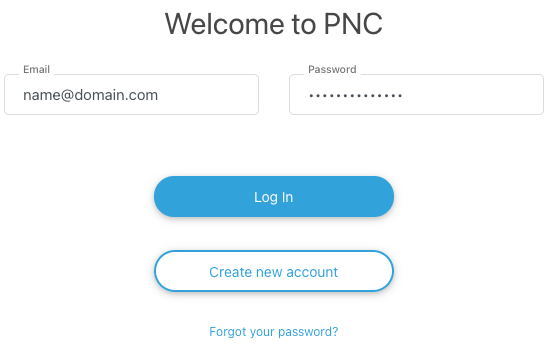

Or create a new account (https://pnc.audiocodes.io):

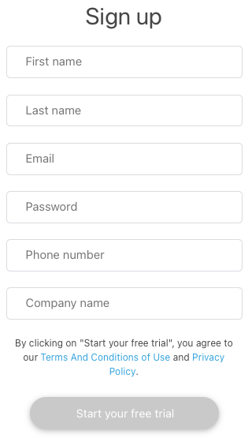


## Credit

Before the bot configuration, you need to add credit to your account. Click on **Billing** (at the bottom of the left menu):

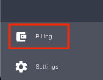

In the next screen, click on **Add credit** button.

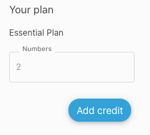

Select the **Credit amount** and fill the credit card data.

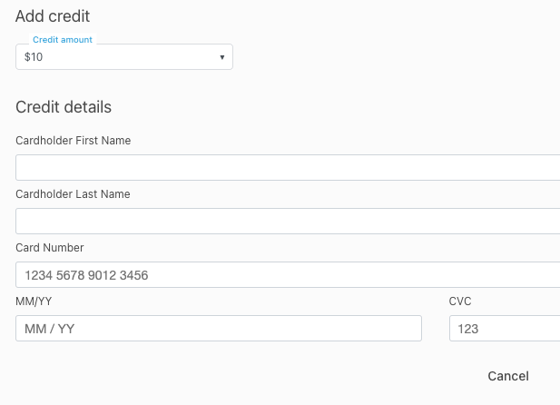


## Bot Configuration

Once you have enough credit, click on **Bots** from the left menu.

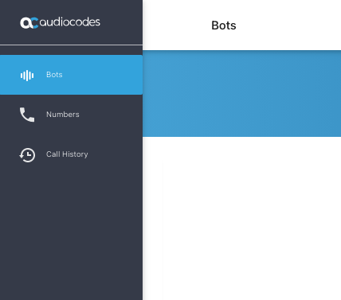

Add a new configuration by clicking on the **+** button at the bottom.


In the newly opened window, choose **AudioCodes Bot API**  (This will be Inbenta in the future) and click **Next**.

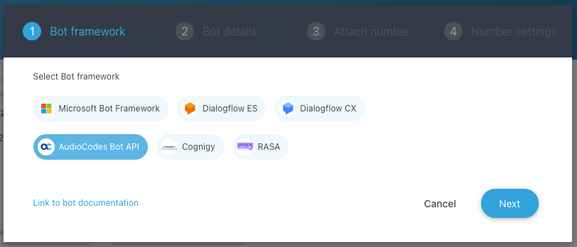

In the next screen, enter a **Bot name**, **Bot URL** (URL where the Inbenta chatbot connector is hosted), and **Token** (This is a password-like value and must be the same as the one defined inside the connector (see [Token](#token) section below for details)).

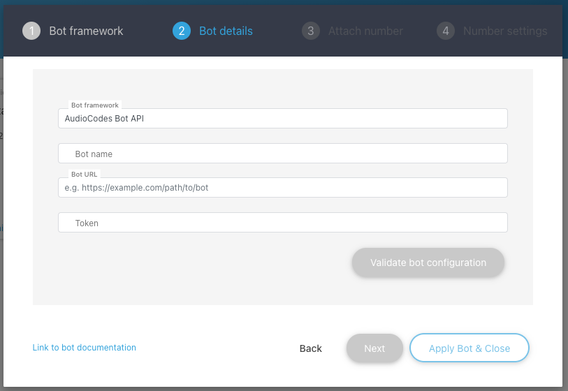

> At the end of the **Bot URL** it MUST end with: “/**CreateConversation**” (e.g. https://boturl.com/CreateConversation)

Once the bot configuration is done, purchase a number or choose an existing number.

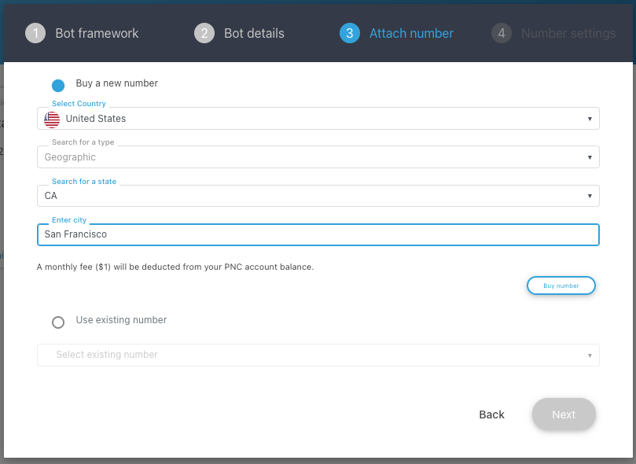

Finally, the configuration of the number is needed.  Choose the configuration for the Phone Number.

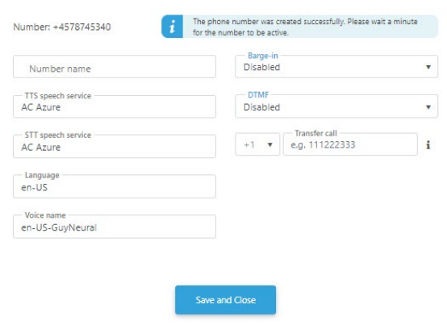

For more information, you can check the “Quick Setup Guide” of Audiocodes:

https://pnc.audiocodes.com/phone-number-connector-integration-audiocodes-bot-api


# Token

**Token** is a password-like value, you can define any value, the only condition is that must have a length greater than or equal to 3. You need to copy and paste in **conf/custom/audiocodes.php** file:

```php
return [
    'token' => '',
    'type' => 'Bearer'
];
```

> The value of the Token is not provided by Inbenta nor Audiocodes, this is defined by the customer.

# Prepare your Inbenta instances

## Text Content

We should always keep in mind that user interaction is going to be through voice. 

Hence, content should be simple text: **avoid the use of HTML tags, multimedia and URLs**. This is especially important if you are using Voice template, most of the HTML tags are not recognized by the TTS (Text-To-Speech) services.

Note: “**Natural Language Search**” is the best **Transition type** for dialogs.

## Farewell content

You can add a command that detects the intent of end the call using voice. This is possible adding a new content with title “**Exit**” (or any other similar with the same context). Inside the content, additionally to the ANSWET_TEXT, you’ll need 2 things:

* Check **directCall** and set the text "**sys-goodbye**"
* Add "**Learn with semantic expansion**" with the variations to end a call (like "goodbye", "end call", etc).

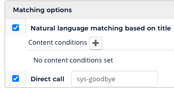